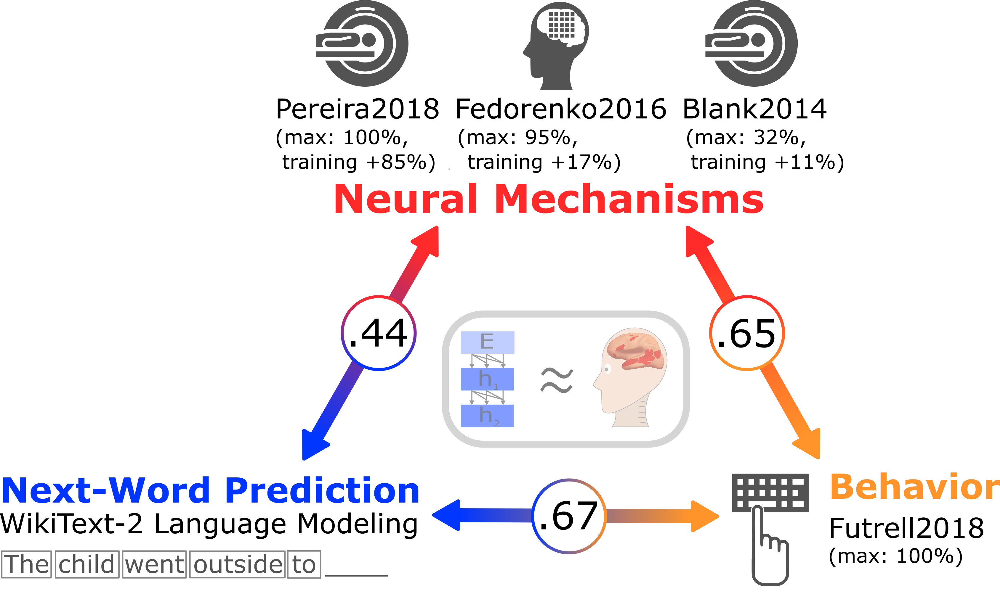

# The neural architecture of language: Integrative modeling converges on predictive processing 

Code accompanying the paper 
[The neural architecture of language: Integrative modeling converges on predictive processing](https://www.pnas.org/content/118/45/e2105646118) by Schrimpf, Blank, Tuckute, Kauf, Hosseini, Kanwisher, Tenenbaum, and Fedorenko.



Large-scale evaluation of neural network language models 
as predictive models of human language processing.
This pipeline compares dozens of state-of-the-art models and 4 human datasets (3 neural, 1 behavioral).
It builds on the [Brain-Score](https://www.Brain-Score.org) framework and can easily be extended with new models and datasets.

Please see the community platform [Brain-Score Language](https://github.com/brain-score/language) for many accessible neural and behavioral benchmarks and computational models, including those from this paper.

## Installation
```bash
git clone https://github.com/mschrimpf/neural-nlp.git
cd neural-nlp
pip install -e .
```
You might have to install nltk by hand / with conda.

## Run
To score gpt2-xl on the Blank2014fROI-encoding benchmark:

```bash
python neural_nlp run --model gpt2-xl --benchmark Blank2014fROI-encoding --log_level DEBUG
```

Other available benchmarks are e.g. Pereira2018-encoding (takes a while to compute), and Fedorenko2016v3-encoding.

You can also specify different models to run -- 
note that some of them require additional download of weights (run `ressources/setup.sh` for automated download).

## Data
When running a model on a benchmark, the data will automatically be downloaded from S3 (e.g. https://github.com/mschrimpf/neural-nlp/blob/master/neural_nlp/benchmarks/neural.py#L361 for the Pereira2018 benchmark). 
Costly ceiling estimates have also been precomputed and will be downloaded since they can take days to compute.

## Precomputed scores
Scores for models run on the neural, behavioral, and computational-task benchmarks are also available, see the [`precomputed-scores.csv`](precomputed-scores.csv) file.
You can re-create the figures in the paper using the [`analyze`](neural_nlp/analyze/__main__.py) scripts.

## Benchmark contextualization
In Schrimpf et al. (2021), each sentence was contextualized with respect to the full set of sentences in the same topic (assuming a fixed order of paragraphs within a topic). We later noticed that this was not how the materials were presented to the participants in Pereira et al. (2018) where sentences were presented in the contexts of paragraphs but paragraphs were randomly ordered for each participant. Below, we show that this error does not affect the results as reported in Schrimpf et al. (2021). In particular, the predictivity values are very closely correlated for these two ways of contextualization.


## Citation
If you use this work, please cite
```
@article{Schrimpf2021,
	author = {Schrimpf, Martin and Blank, Idan and Tuckute, Greta and Kauf, Carina and Hosseini, Eghbal A. and Kanwisher, Nancy and Tenenbaum, Joshua and Fedorenko, Evelina},
	title = {The neural architecture of language: Integrative modeling converges on predictive processing},
	year = {2021},
	journal = {Proceedings of the National Academy of Sciences},
	url = {https://www.pnas.org/content/118/45/e2105646118}
}

```
